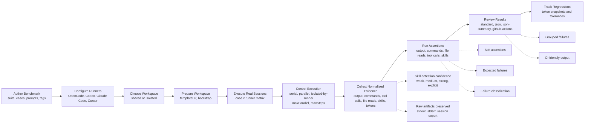

# Skillgym Demo Workflow Graph

```mermaid
flowchart LR
  A[Author Benchmark<br/>suite, cases, prompts, tags] --> B[Configure Runners<br/>OpenCode, Codex, Claude Code, Cursor]
  B --> C[Choose Workspace<br/>shared or isolated]
  C --> D[Prepare Workspace<br/>templateDir, bootstrap]
  D --> E[Execute Real Sessions<br/>case x runner matrix]
  E --> F[Control Execution<br/>serial, parallel, isolated-by-runner<br/>maxParallel, maxSteps]
  F --> G[Collect Normalized Evidence<br/>output, commands, tool calls, file reads, skills, tokens]
  G --> H[Run Assertions<br/>output, commands, file reads, tool calls, skills]
  H --> I[Review Results<br/>standard, json, json-summary, github-actions]
  I --> J[Track Regressions<br/>token snapshots and tolerances]

  H -.-> H1[Soft assertions]
  H -.-> H2[Expected failures]
  H -.-> H3[Failure classification]

  G -.-> G1[Skill detection confidence<br/>weak, medium, strong, explicit]
  G -.-> G2[Raw artifacts preserved<br/>stdout, stderr, session export]

  I -.-> I1[Grouped failures]
  I -.-> I2[CI-friendly output]
```
